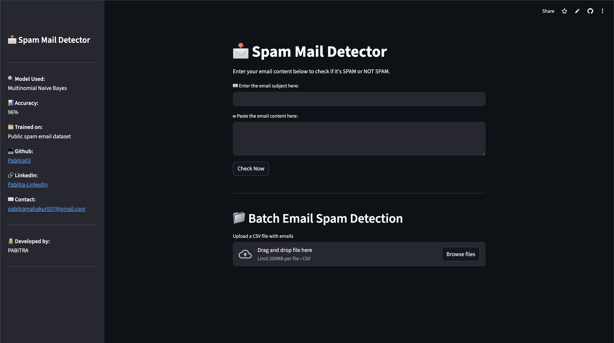

# 📧 Spam Mail Detection Web App  

A simple web app that detects whether an email is Spam or Not Spam.
It uses Streamlit, Scikit-Learn, and a trained Machine Learning model with TF-IDF text features.

---

## 🚀 Features
- 🔍 Classifies email text as **Spam / Not Spam**
- 🎯 Uses a pre-trained machine learning model (`trained_spam_model1.sav`)
- 📊 Uses TF-IDF vectorization (`vectorizer.pkl`)
- 📁 Includes sample test emails (`testemails.csv`)

---

## 🧠 Tech Stack
- **Python**
- **Streamlit**
- **Scikit-Learn**
- **Pandas**
- **NumPy**
- **Pickle (loading saved model)**

---
### 📦 Project Structure

```text
SPAM-MAIL-DETECTION/
├── app.py
├── vectorizer.pkl
├── trained_spam_model1.sav
├── testemails.csv
├── requirements.txt
├── Procfile
├── runtime.txt
└── setup.sh
```
---
## 🚀 How to Run This Project

Follow the steps below to set up and run the Spam Mail Detection Web App:

---

### 🔹 1. Create a Virtual Environment
```bash
py -3.10 -m venv venv
source venv/bin/activate
```
### 🔹 2. Install Dependencies
```bash
pip install -r requirements.txt
```
### 🔹 3. Run the Streamlit App
```bash
streamlit run app.py
```

---
## 📸 Screenshot


